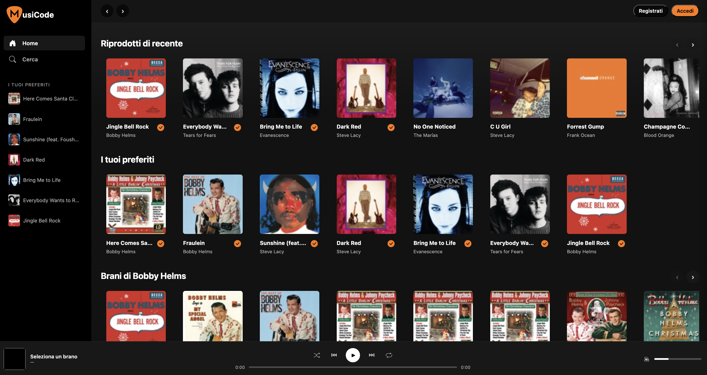
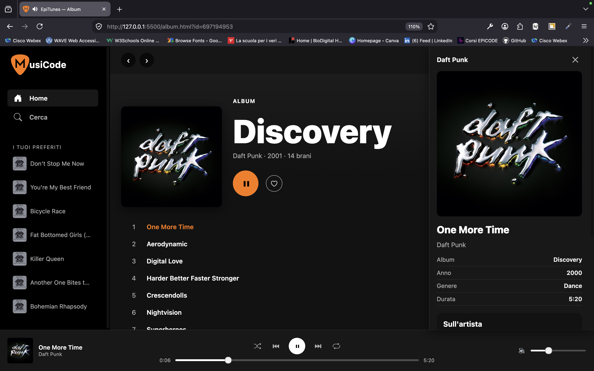
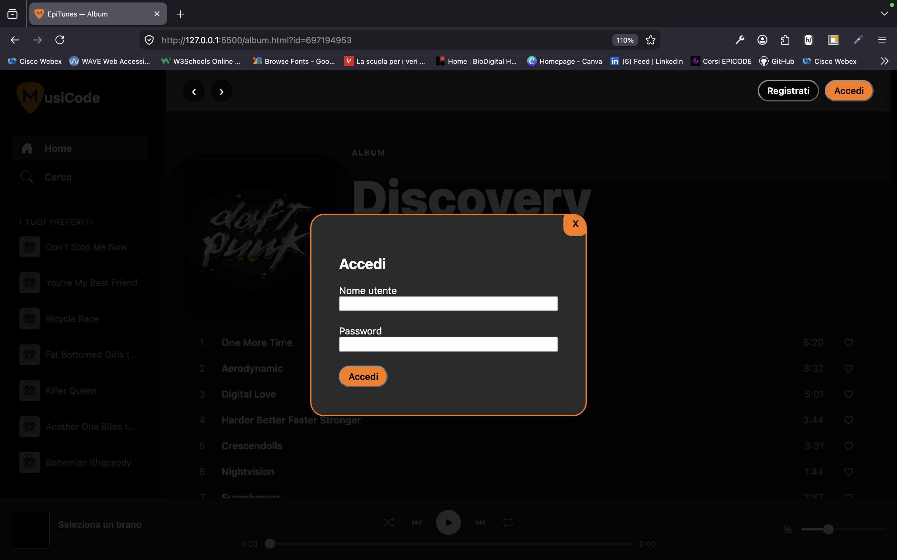
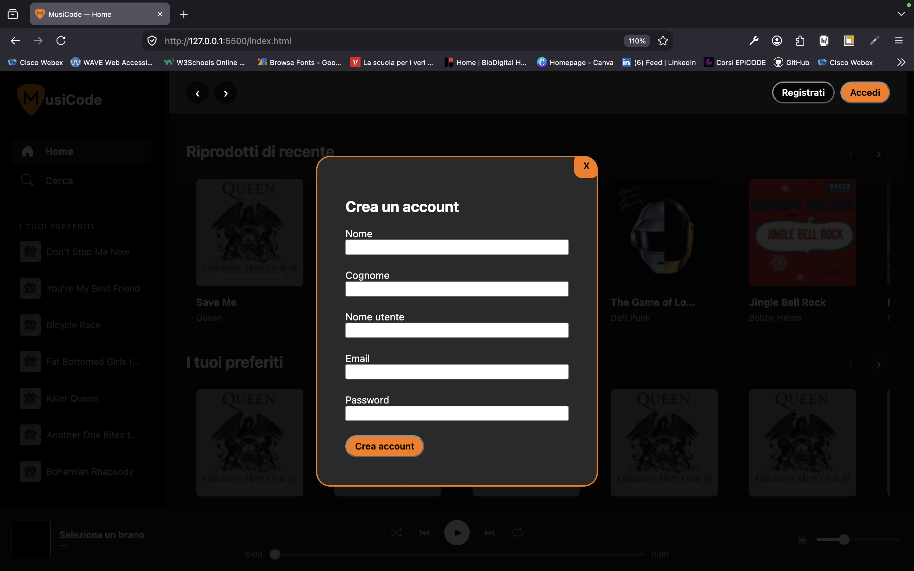
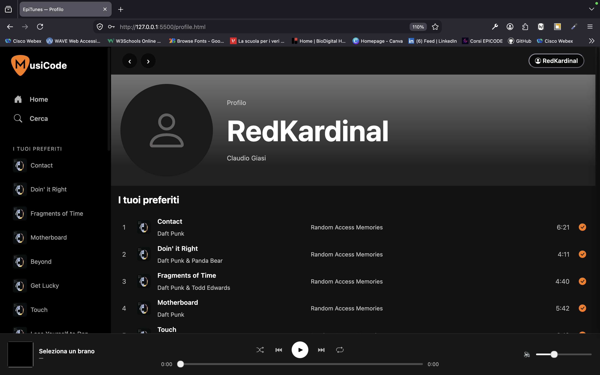

# MusiCode

🇬🇧 English | [🇮🇹 Italiano](README.it.md)

Spotify-style web app built during Epicode's Build Week. It lets you search for tracks, albums and artists, listen to audio previews, save favourites tied to your account, and manage a simple login/registration system based on `localStorage`.

## Features

- **Home**: carousels of featured tracks, albums and artists
- **Search**: live search for tracks/albums/artists
- **Detail pages**: Album, Artist and Track with tracklist and player
- **Favourites**: save favourite tracks, tied to the logged-in account
- **Login / Registration**: account and session management via `localStorage`, with favourites refresh on login
- **Audio player**: play/pause, previous/next track, shuffle, repeat, progress bar and volume
- **Profile**: user page with a favourites summary
- **Responsive layout**, with a dedicated mobile version

## Features in detail

### Home

Scrollable carousels with featured tracks, albums and artists, loaded from external APIs.



### Detail pages (Album)

Album tracklist view, with an integrated player.



### Login / Registration

Login and registration modal, with account and session saved in `localStorage` and automatic favourites refresh on login.




### Profile

User page with account details and a favourites summary.



## Technologies

- HTML, CSS, JavaScript (vanilla, no framework)
- [Bootstrap Icons](https://icons.getbootstrap.com/)
- [iTunes Search API](https://developer.apple.com/library/archive/documentation/AudioVideo/Conceptual/iTuneSearchAPI/) for tracks, albums and artists
- [TheAudioDB API](https://www.theaudiodb.com/) for additional artist data

## Project structure

```
.
├── index.html          # Home
├── search.html         # Search
├── album.html          # Album detail
├── artist.html         # Artist detail
├── track.html           # Track detail
├── favourites.html      # Favourites
├── profile.html         # User profile
└── assets/
    ├── css/app.css       # Styles
    ├── js/               # Per-page logic (common, home, search, album, artist, track, favourites, profile)
    └── img/              # Logos and placeholder images
```

## Running the project

There are no dependencies or build steps, so just serve the folder with a static server (e.g. VS Code's Live Server extension) and open `index.html`, or open it directly in the browser.

## Team

Project developed as a group during Build Week 2 of the Epicode course.

- Manuel
- Kian
- Angelo
- Yhara
- Claudio
